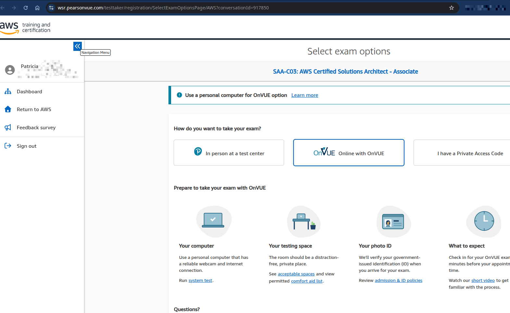
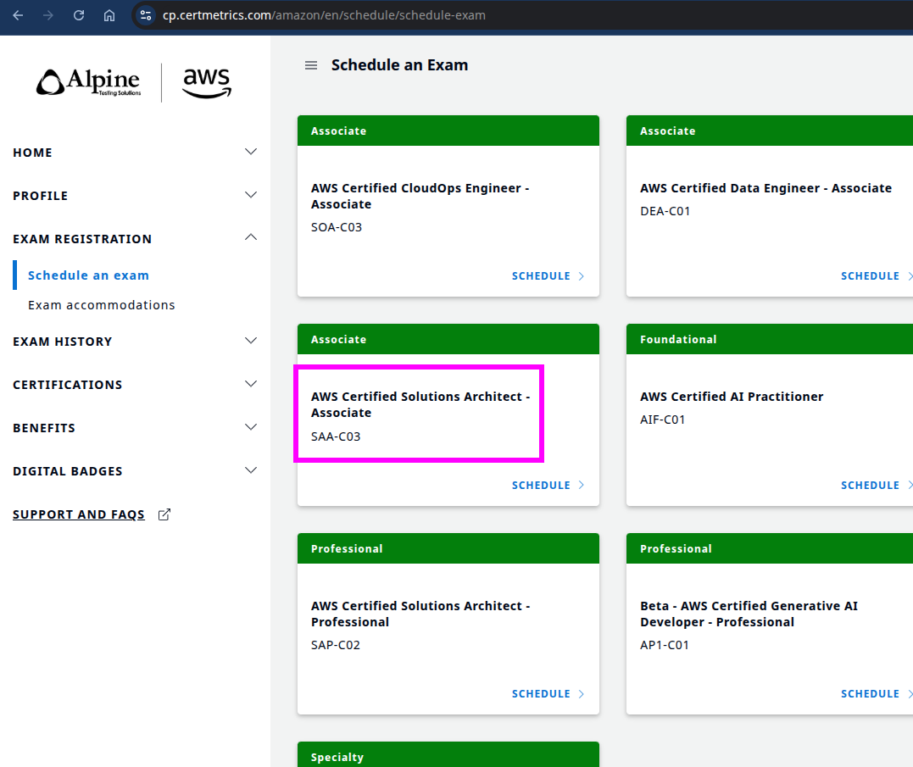

# aws-certification-2026

## resources:
- [AWS Certified Solutions Architect – Associate (SAA-C03) Exam Guide](https://aws.amazon.com/certification/certified-solutions-architect-associate/)

why to take this certification?
- Validate your expertise in designing and deploying scalable systems on AWS.
- Enhance your career prospects in cloud architecture.
- Gain recognition as an AWS Certified Solutions Architect.
- Access to exclusive AWS Certified community and resources.
- Stay updated with the latest AWS services and best practices.
- Improve your ability to design cost-effective and resilient cloud solutions.
- Prepare for advanced AWS certifications and career growth opportunities.
- Demonstrate your commitment to professional development in cloud computing.
- Increase your earning potential in the IT industry.
- Build confidence in your cloud architecture skills and knowledge.
- Hands-on experience with AWS services and solutions.
- Networking opportunities with other AWS professionals.
- Access to AWS Certified merchandise and events.
- Recognition from employers and peers in the tech industry.
- Ability to contribute to your organization's cloud strategy and initiatives.
- Preparation for real-world cloud architecture challenges.
- Enhanced problem-solving skills in cloud environments.
- Opportunity to work on diverse projects involving AWS technologies.

### exam badge
https://wsr.pearsonvue.com/testtaker/registration/SelectExamOptionsPage/AWS?conversationId=917850

### schedule an exam
https://cp.certmetrics.com/amazon/en/schedule/schedule-exam

## exam details
- **Exam Code:** SAA-C03
- **Format:** Multiple choice and multiple response questions
- **Time:** 130 minutes
- **Cost:** $150 USD (practice exam: $20 USD)

- **Languages:** English, Japanese, Korean, and Simplified Chinese
- **Prerequisites:** None, but recommended to have at least one year of hands-on experience
- **Registration:** Through AWS Training and Certification portal
- **Validity:** 3 years
- **Retake Policy:** 14 days waiting period for retakes, up to 3 attempts in a year
- **Passing Score:** Varies (AWS does not disclose exact passing scores)
- **Exam Delivery:** Online proctored or in testing centers
- **Preparation Resources:** Official AWS training, whitepapers, practice exams, and hands-on labs
- **Target Audience:** Individuals in solutions architect roles with experience designing distributed applications and systems on the AWS platform.
- **Exam Objectives:** Design resilient architectures, define performant architectures, specify secure applications and architectures, and design cost-optimized architectures.
- **Exam Policies:** Adherence to AWS certification exam policies, including identification requirements and exam conduct.
- **Continuing Education:** Option to recertify through continuing education or retaking the exam before expiration.
- **Support:** Access to AWS Certification support for exam-related inquiries and issues.
- **Exam Updates:** Regular updates to exam content to reflect new AWS services and best practices.
- **Official Study Guide:** Available for purchase on Amazon and other retailers.
- **Practice Exams:** Available through AWS Training and Certification portal.
- **Hands-on Labs:** Available through AWS Skill Builder and other platforms.
- **Community Resources:** AWS forums, study groups, and online communities for peer support and knowledge sharing.
- **Exam Day Tips:** Arrive early, bring valid ID, and read questions carefully.
- **Post-Exam:** Receive score report and certification status via email.
- **Certification Benefits:** Digital badge, access to AWS Certified LinkedIn Community, and eligibility for AWS Certified events.
- **Renewal Process:** Recertification required every 3 years through exam retake or continuing education.
- **Exam Accommodations:** Available for candidates with disabilities or special needs upon request.
- **Non-Disclosure Agreement:** Candidates must agree to AWS's NDA before taking the exam.
- **Exam Feedback:** Opportunity to provide feedback on exam experience after completion.
- **Exam Security:** Strict security measures in place to ensure exam integrity.
- **Exam Preparation Time:** Varies based on individual experience and study habits; typically ranges from a few weeks to several months.
- **Recommended Experience:** Hands-on experience with AWS services, including compute, storage, networking, and security.
- **Exam Content Outline:** Detailed outline available on AWS Certification website, covering key topics and domains.
- **Study Plan:** Create a structured study plan based on exam objectives and personal schedule.
- **Mock Exams:** Take multiple mock exams to simulate real exam conditions and improve time management skills.
- **Review AWS Whitepapers:** Focus on key whitepapers recommended by AWS for the SAA-C03 exam.
- **Join Study Groups:** Participate in study groups or forums to discuss topics and share resources.
- **Utilize AWS Free Tier:** Gain hands-on experience by using AWS Free Tier services for practice.
- **Stay Updated:** Keep up with the latest AWS announcements and service updates relevant to the exam.
- **Focus on Weak Areas:** Identify and focus on areas where you need improvement during your study sessions.
- **Use Flashcards:** Create or use existing flashcards for quick review of key concepts and terms.
- **Time Management:** Practice managing your time effectively during the exam to ensure you can answer all questions.
- **Relax Before the Exam:** Get a good night's sleep and stay calm on exam day to perform your best.
- **Post-Certification Learning:** Continue learning and exploring AWS services even after obtaining the certification to stay current in the field.
## domains covered
1. **Design Resilient Architectures (30%)**
   - Design a multi-tier architecture solution
   - Design highly available and/or fault-tolerant architectures
   - Design decoupling mechanisms using AWS services
   - Choose appropriate resilient storage
2. **Design High-Performing Architectures (28%)**
   - Identify elastic and scalable compute solutions for a workload
   - Select high-performing and scalable storage solutions for a workload
   - Select high-performing networking solutions for a workload
   - Choose high-performing database solutions for a workload
3. **Design Secure Applications and Architectures (24%)**
    - Design secure access to AWS resources
    - Design secure application tiers
    - Select appropriate data security options
    - Design a secure network infrastructure
4. **Design Cost-Optimized Architectures (18%)**
    - Identify cost-effective storage solutions
    - Identify cost-effective compute and database services
    - Design cost-optimized network architectures
    - Choose cost-effective solutions for data transfer
## tips to prepare
- Understand the exam format and question types.
- Review the official AWS exam guide and sample questions.
- Take advantage of AWS training resources, including online courses and webinars.
- Study AWS whitepapers and FAQs related to the exam domains.
- Gain hands-on experience with AWS services through practical labs and projects.
- Join study groups or forums to discuss topics and share knowledge with peers.
- Use practice exams to assess your knowledge and identify areas for improvement.
- Create a study schedule and stick to it, allowing ample time for review and practice.
- Focus on understanding core AWS services and their use cases.
- Review case studies and real-world scenarios to understand how to apply AWS services effectively.
- Stay updated with the latest AWS service announcements and best practices.
- Take care of your health and well-being during the preparation period to ensure optimal focus and retention.
- On exam day, read each question carefully and manage your time effectively to ensure you can answer all questions.
- After the exam, review your results and identify areas for further learning and improvement, regardless of the outcome.
## additional resources
- [AWS Skill Builder](https://explore.skillbuilder.aws/learn)
- [AWS Whitepapers](https://aws.amazon.com/whitepapers/)
- [AWS FAQs](https://aws.amazon.com/faqs/)
- [AWS Training and Certification](https://aws.amazon.com/training/)
- [AWS YouTube Channel](https://www.youtube.com/user/AmazonWebServices)
- [AWS Documentation](https://docs.aws.amazon.com/)
- [AWS Well-Architected Framework](https://aws.amazon.com/architecture/well-architected/)
- [AWS Online Tech Talks](https://aws.amazon.com/events/online-tech-talks/)
- [AWS Blogs](https://aws.amazon.com/blogs/)
- [AWS Forums](https://forums.aws.amazon.com/)
- [Udemy AWS Certified Solutions Architect – Associate Course](https://www.udemy.com/course/aws-certified-solutions-architect-associate/)
- [A Cloud Guru](https://acloudguru.com/)
- [Linux Academy](https://linuxacademy.com/)
- [Whizlabs AWS Certified Solutions Architect – Associate Practice Tests](https://www.whizlabs.com/aws-solutions-architect-associate/)
- [Tutorials Dojo AWS Certified Solutions Architect – Associate Practice Exams](https://tutorialsdojo.com/aws-certified-solutions-architect-associate-saa-c03/)
- [ExamPro AWS Certified Solutions Architect – Associate Course](https://www.exampro.co/aws-solutions-architect-associate)
- [FreeCodeCamp AWS Certified Solutions Architect – Associate Course](https://www.freecodecamp.org/news/aws-certified-solutions-architect-associate-saa-c03-full-course/)
- [LinkedIn Learning AWS Certified Solutions Architect – Associate Course](https://www.linkedin.com/learning/aws-certified-solutions-architect-associate-saa-c03)
- [Pluralsight AWS Certified Solutions Architect – Associate Path](https://www.pluralsight.com/paths/aws-certified-solutions-architect-associate)
- [Cloud Academy AWS Certified Solutions Architect – Associate Course](https://cloudacademy.com/learning-paths/aws-certified-solutions-architect-associate-saa-c03-1371/)
- [ExamTopics AWS Certified Solutions Architect – Associate Practice Tests](https://www.examtopics.com/exams/aws/aws-certified-solutions-architect-associate-saa-c03/view/)
- [Reddit r/AWSCertifications](https://www.reddit.com/r/AWSCertifications/)
- [GitHub - aws-certification-2026](https://github.com/aws-certification-2026)
- [YouTube - AWS Certified Solutions Architect – Associate Playlist](https://www.youtube.com/playlist?list=PL2h0lX1fH6v1k1J7j3J6J6J6J6J6J6J6)
- [Medium - AWS Certified Solutions Architect – Associate Articles](https://medium.com/tag/aws-certified-solutions-architect-associate)
- [Twitter - AWS Certified Solutions Architect – Associate Tweets](https://twitter.com/search?q=AWS%20Certified%20Solutions%20Architect%20Associate&src=typed_query)
- [Facebook - AWS Certified Solutions Architect – Associate Group](https://www.facebook.com/groups/AWSCertifiedSolutionsArchitectAssociate/)
- [Instagram - AWS Certified Solutions Architect – Associate Posts](https://www.instagram.com/explore/tags/awscertifiedsolutionsarchitectassociate/)
- [Pinterest - AWS Certified Solutions Architect – Associate Pins](https://www.pinterest.com/search/pins/?q=AWS%20Certified%20Solutions%20Architect%20Associate&rs=typed)
- [Quora - AWS Certified Solutions Architect – Associate Questions](https://www.quora.com/topic/AWS-Certified-Solutions-Architect-Associate)
- [Stack Overflow - AWS Certified Solutions Architect – Associate Questions](https://stackoverflow.com/questions/tagged/aws-certified-solutions-architect-associate)
- [GitHub - AWS Certified Solutions Architect – Associate Repositories](https://github.com/topics/aws-certified-solutions-architect-associate)
- [AWS Events](https://aws.amazon.com/events/)
- [AWS Summit](https://aws.amazon.com/summits/)
- [AWS re:Invent](https://reinvent.awsevents.com/)
- [AWS User Groups](https://aws.amazon.com/developer/community/user-groups/)
- [AWS Podcasts](https://aws.amazon.com/podcasts/)
- [AWS News Blog](https://aws.amazon.com/blogs/aws/)
- [AWS Certification Blog](https://aws.amazon.com/certification/blog/)
- [AWS Training YouTube Channel](https://www.youtube.com/c/AWSTraining)
- [AWS Learning Library](https://aws.amazon.com/training/learning-library/)
- [AWS Cloud Practitioner Essentials Course](https://www.aws.training/Details/Curriculum?id=20685)
- [AWS Solutions Architect Learning Path](https://www.aws.training/Details/LearningPath?id=20685)
- [AWS Well-Architected Labs](https://www.wellarchitectedlabs.com/)
- [AWS Hands-On Labs](https://aws.amazon.com/training/hands-on-labs/)
- [AWS Free Tier](https://aws.amazon.com/free/)
- [AWS Certified Solutions Architect – Associate Exam Readiness Course](https://www.aws.training/Details/Course?id=20685)
- [AWS Certified Solutions Architect – Associate Exam Guide PDF](https://d1.awsstatic.com/training-and-certification/docs-sa-assoc/AWS_Certified_Solutions_Architect_Associate_Exam_Guide.pdf)
- [AWS Certified Solutions Architect – Associate Sample Questions PDF](https://d1.awsstatic.com/training-and-certification/docs-sa-assoc/AWS_Certified_Solutions_Architect_Associate_Sample_Questions.pdf)
- [AWS Certified Solutions Architect – Associate Practice Exam](https://www.aws.training/Details/Exam?id=20685)
- [AWS Certified Solutions Architect – Associate Official Study Guide Book](https://www.amazon.com/AWS-Certified-Solutions-Architect-Associate/dp/111950421X)
- [AWS Certified Solutions Architect – Associate Exam Blueprint](https://d1.awsstatic.com/training-and-certification/docs-sa-assoc/AWS_Certified_Solutions_Architect_Associate_Exam_Blueprint.pdf)
- [AWS Certified Solutions Architect – Associate Exam Readiness Webinar](https://www.aws.training/Details/Webinar?id=20685)
- [AWS Certified Solutions Architect – Associate Exam Tips Blog Post](https://aws.amazon.com/blogs/training-and-certification/tips-to-prepare-for-the-aws-certified-solutions-architect-associate-exam/)
- [AWS Certified Solutions Architect – Associate Exam Experience Video](https://www.youtube.com/watch?v=example)
- [AWS Certified Solutions Architect – Associate Exam Day Checklist](https://d1.awsstatic.com/training-and-certification/docs-sa-assoc/AWS_Certified_Solutions_Architect_Associate_Exam_Day_Checklist.pdf)
- [AWS Certified Solutions Architect – Associate Exam FAQs](https://aws.amazon.com/certification/certified-solutions-architect-associate/faqs/)
- [AWS Certified Solutions Architect – Associate Exam Policies](https://aws.amazon.com/certification/certified-solutions-architect-associate/policies/)
- [AWS Certified Solutions Architect – Associate Exam Accommodations](https://aws.amazon.com/certification/certified-solutions-architect-associate/accommodations/)
- [AWS Certified Solutions Architect – Associate Exam Security Measures](https://aws.amazon.com/certification/certified-solutions-architect-associate/security-measures/)
- [AWS Certified Solutions Architect – Associate Exam Feedback Form](https://d1.awsstatic.com/training-and-certification/docs-sa-assoc/AWS_Certified_Solutions_Architect_Associate_Exam_Feedback_Form.pdf)
- [AWS Certified Solutions Architect – Associate Recertification Guide](https://aws.amazon.com/certification/certified-solutions-architect-associate/recertification-guide/)
- [AWS Certified Solutions Architect – Associate Continuing Education Options](https://aws.amazon.com/certification/certified-solutions-architect-associate/continuing-education-options/)
- [AWS Certified Solutions Architect – Associate Support Contact Information](https://aws.amazon.com/certification/certified-solutions-architect-associate/support-contact-information/)
- [AWS Certified Solutions Architect – Associate Exam Updates](https://aws.amazon.com/certification/certified-solutions-architect-associate/exam-updates/)
- [AWS Certified Solutions Architect – Associate Official Study Guide eBook](https://www.amazon.com/AWS-Certified-Solutions-Architect-Associate-ebook/dp/B08XYZ1234)
- [AWS Certified Solutions Architect – Associate Practice Exams on Udemy](https://www.udemy.com/course/aws-certified-solutions-architect-associate-practice-exams/)
- [AWS Certified Solutions Architect – Associate Study Notes on GitHub](https://github.com/aws-samples/aws-certified-solutions-architect-associate)
- [AWS Certified Solutions Architect – Associate YouTube Study Playlist](https://www.youtube.com/playlist?list=PLhW3qG5bs-L9J2Yk9X9X9X9X9X9X9X9X9)
- [AWS Certified Solutions Architect – Associate Reddit Study Group](https://www.reddit.com/r/AWSCertifications/comments/xyz123/aws_certified_solutions_architect_associate_study/)
- [AWS Certified Solutions Architect – Associate Twitter Study Hashtag](https://twitter.com/hashtag/AWSCertifiedSolutionsArchitectAssociate)
- [AWS Certified Solutions Architect – Associate Facebook Study Group](https://www.facebook.com/groups/AWSCertifiedSolutionsArchitectAssociateStudyGroup/)
- [AWS Certified Solutions Architect – Associate Instagram Study Posts](https://www.instagram.com/explore/tags/awscertifiedsolutionsarchitectassociate/)
- [AWS Certified Solutions Architect – Associate Pinterest Study Pins](https://www.pinterest.com/search/pins/?q=AWS%20Certified%20Solutions%20Architect%20Associate%20Study&rs=typed)
- [AWS Certified Solutions Architect – Associate Quora Study Questions](https://www.quora.com/topic/AWS-Certified-Solutions-Architect-Associate-Study)
- [AWS Certified Solutions Architect – Associate Stack Overflow Study Questions](https://stackoverflow.com/questions/tagged/aws-certified-solutions-architect-associate-study)
- [AWS Certified Solutions Architect – Associate GitHub Study Repositories](https://github.com/search?q=AWS+Certified+Solutions+Architect+Associate+Study)
- [AWS Certified Solutions Architect – Associate Exam Day Tips Video](https://www.youtube.com/watch?v=example2)
- [AWS Certified Solutions Architect – Associate Post-Exam Review Guide](https://d1.awsstatic.com/training-and-certification/docs-sa-assoc/AWS_Certified_Solutions_Architect_Associate_Post-Exam_Review_Guide.pdf)
- [AWS Certified Solutions Architect – Associate Continuing Education Resources](https://aws.amazon.com/certification/certified-solutions-architect-associate/continuing-education-resources/)
- [AWS Certified Solutions Architect – Associate Support FAQ](https://aws.amazon.com/certification/certified-solutions-architect-associate/support-faq/)
- [AWS Certified Solutions Architect – Associate Exam Changes Announcement](https://aws.amazon.com/certification/certified-solutions-architect-associate/exam-changes-announcement/)
- [AWS Certified Solutions Architect – Associate Official Study Guide Companion Website](https://www.wiley.com/go/aws-certified-solutions-architect-associate-saa-c03)
- [AWS Certified Solutions Architect – Associate Practice Exams on Whizlabs](https://www.whizlabs.com/aws-solutions-architect-associate-saa-c03-practice-tests/)
- [AWS Certified Solutions Architect – Associate Study Guides on Tutorials Dojo](https://tutorialsdojo.com/aws-certified-solutions-architect-associate-saa-c03-study-guides/)
- [AWS Certified Solutions Architect – Associate Course on ExamPro](https://www.exampro.co/aws-solutions-architect-associate-saa-c03-course)
- [AWS Certified Solutions Architect – Associate Full Course on FreeCodeCamp](https://www.freecodecamp.org/news/aws-certified-solutions-architect-associate-saa-c03-full-course/)
- [AWS Certified Solutions Architect – Associate Course on LinkedIn Learning](https://www.linkedin.com/learning/aws-certified-solutions-architect-associate-saa-c03-course)
- [AWS Certified Solutions Architect – Associate Learning Path on Pluralsight](https://www.pluralsight.com/paths/aws-certified-solutions-architect-associate-saa-c03)
- [AWS Certified Solutions Architect – Associate Course on Cloud Academy](https://cloudacademy.com/learning-paths/aws-certified-solutions-architect-associate-saa-c03-1371/)
- [AWS Certified Solutions Architect – Associate Practice Tests on ExamTopics](https://www.examtopics.com/exams/amazon/aws-certified-solutions-architect-associate-saa-c03/view/)

## good luck!
- Wishing you success on your AWS Certified Solutions Architect – Associate exam journey!
- Remember to stay focused, study diligently, and believe in your abilities. You've got this!
- Don't hesitate to reach out to the AWS community for support and guidance.
- Celebrate your achievements and keep pushing forward in your cloud career!
- Happy studying and best of luck on your certification exam!

