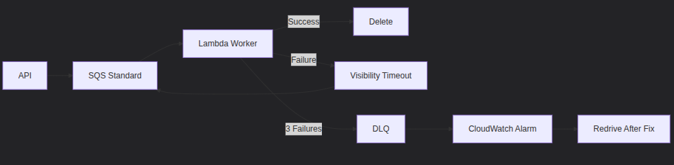

## Study Plan for Certification Exam
- **Study Plan:** Create a structured study plan based on exam objectives and personal schedule.
- **Mock Exams:** Take multiple mock exams to simulate real exam conditions and improve time management skills.
- **Use Flashcards:** Create or use existing flashcards for quick review of key concepts and terms.

## flash cards for key concepts and terms based on the study plan
**Flashcard 1:**
- **Front:** What is the purpose of creating a structured study plan?
- **Back:** To organize study time effectively, cover all exam objectives, and ensure consistent progress.
**Flashcard 2:**
- **Front:** Name one effective technique for retaining information.
- **Back:** Active Learning – engaging with the material through discussions and practical application.
**Flashcard 3:**
- **Front:** What is the Pomodoro Technique?
- **Back:** A time management method that involves studying for 25 minutes followed by a 5-minute break to enhance focus and prevent burnout.
**Flashcard 4:**
- **Front:** Why are mock exams important in exam preparation?
- **Back:** They simulate real exam conditions, help improve time management skills, and identify areas that need further study.
**Flashcard 5:**
- **Front:** What should be done during the final week before the exam?
- **Back:** Review summary notes and flashcards, and ensure adequate rest and relaxation before the exam day.
**Flashcard 6:**
- **Front:** Name one recommended study material for exam preparation.
- **Back:** "Official Certification Guide" by [Publisher Name].
**Flashcard 7:**
- **Front:** How can setting goals and rewards help in staying motivated?
- **Back:** It provides a sense of achievement and encourages continued effort by celebrating small successes.
**Flashcard 8:**
- **Front:** What topics should be focused on during weeks 5-6 of the study schedule?
- **Back:** Deep dive into advanced topics and explore complex subjects and case studies.
**Flashcard 9:**
- **Front:** What is the benefit of using flashcards in studying?
- **Back:** They allow for quick review of key concepts and terms, aiding in memory retention
**Flashcard 10:**
- **Front:** What activities are recommended during weeks 3-4 of the study schedule?
- **Back:** Study fundamental topics, create summary notes, and use flashcards for key terms and definitions.

## IAM FLASHCARDS
lets start with IAM (Identity and Access Management) concepts.
**Flashcard 1:**
- **Front:** What is Identity and Access Management (IAM)?
- **Back:** IAM is a framework of policies and technologies that ensures the right individuals have access to the right resources at the right times for the right reasons.
**Flashcard 2:**
- **Front:** What are the main components of IAM?
- **Back:** The main components of IAM include Identity Management, Access Management, and Privileged Access Management.
**Flashcard 3:**
- **Front:** What is the principle of least privilege in IAM?
- **Back:** The principle of least privilege states that users should be granted the minimum levels of access – or permissions – needed to perform their job functions.
**Flashcard 4:**
- **Front:** What is Multi-Factor Authentication (MFA)?
- **Back:** MFA is a security system that requires more than one method of authentication from independent categories of credentials to verify the user's identity.
**Flashcard 5:**
- **Front:** What is Single Sign-On (SSO)?
- **Back:** SSO is an authentication process that allows a user to access multiple applications with one set of login credentials.
**Flashcard 6:**
- **Front:** What is Role-Based Access Control (RBAC)?
- **Back:** RBAC is a method of regulating access to computer or network resources based on the roles of individual users within an organization.
**Flashcard 7:**
- **Front:** What is the difference between authentication and authorization in IAM?
- **Back:** Authentication is the process of verifying a user's identity, while authorization is the process of granting or denying access to resources based on that identity.
**Flashcard 8:**
- **Front:** What is a digital identity in the context of IAM?
- **Back:** A digital identity is the online representation of an individual, organization, or device, consisting of attributes and credentials used for authentication and access control.
**Flashcard 9:**
- **Front:** What is Privileged Access Management (PAM)?
- **Back:** PAM is a subset of IAM that focuses on managing and monitoring access to critical
    systems and sensitive information by privileged users.
**Flashcard 10:**
- **Front:** Why is IAM important for organizational security?
- **Back:** IAM is crucial for protecting sensitive data, ensuring compliance with regulations, and reducing the risk of unauthorized access and data breaches.
**Flashcard 11:**
- **Front:** What is an access control list (ACL)?
- **Back:** An ACL is a list of permissions attached to an object that specifies which users or system processes are granted access to that object and what operations they can perform.
**Flashcard 12:**
- **Front:** What is the difference between a user and a group in IAM?
- **Back:** A user is an individual identity with specific access rights, while a group is a collection of users that can be assigned shared access permissions.
**Flashcard 13:**
- **Front:** What is federation in IAM?
- **Back:** Federation is a process that allows users to access multiple systems or applications using a single set of credentials, often across different organizations.
**Flashcard 14:**
- **Front:** What is the role of policies in IAM?
- **Back:** Policies in IAM define the rules and conditions under which access to resources is granted or denied.
**Flashcard 15:**
- **Front:** What is the difference between identity management and access management?
- **Back:** Identity management focuses on creating, maintaining, and deleting user identities, while access management focuses on controlling access to resources based on those identities.
**Flashcard 16:**
- **Front:** What is a security token in IAM?
- **Back:** A security token is a physical or digital device that provides an additional layer of security by generating a one-time password or code for authentication.
**Flashcard 17:**
- **Front:** What is the concept of "just-in-time" access in IAM?
- **Back:** "Just-in-time" access is a security practice that grants users temporary access to resources only when needed, reducing the risk of prolonged access.
**Flashcard 18:**
- **Front:** What is the difference between synchronous and asynchronous authentication?
- **Back:** Synchronous authentication requires real-time interaction between the user and the authentication system, while asynchronous authentication allows for delayed verification, such as through email or SMS codes.
**Flashcard 19:**
- **Front:** What is the purpose of audit logs in IAM?
- **Back:** Audit logs record user activities and access events, helping organizations monitor compliance, detect security incidents, and conduct investigations.
**Flashcard 20:**
- **Front:** What is the concept of "zero trust" in IAM?
- **Back:** "Zero trust" is a security model that assumes no user or device is trusted by default, requiring continuous verification of identity and access rights.
**Flashcard 21:**
- **Front:** What is the difference between a password and a passphrase in IAM?
- **Back:** A password is typically a short string of characters used for authentication, while a passphrase is a longer sequence of words or characters that provides enhanced security.
**Flashcard 22:**
- **Front:** What is the role of encryption in IAM?
- **Back:** Encryption protects sensitive data during transmission and storage, ensuring that only authorized users can access the information.
**Flashcard 23:**
- **Front:** What is the concept of "identity federation"?
- **Back:** Identity federation allows users to access multiple systems or applications across different organizations using a single set of credentials.
**Flashcard 24:**
- **Front:** What is the difference between a centralized and decentralized IAM system?
- **Back:** A centralized IAM system manages identities and access from a single location, while a decentralized IAM system distributes management across multiple locations or systems.
**Flashcard 25:**
- **Front:** What is the purpose of user provisioning in IAM?
- **Back:** User provisioning is the process of creating, managing, and deleting user accounts and access rights within an organization.
**Flashcard 26:**
- **Front:** What is the concept of "access reviews" in IAM?
- **Back:** Access reviews are periodic evaluations of user access rights to ensure that permissions are appropriate and comply with security policies.
**Flashcard 27:**
- **Front:** What is the difference between implicit and explicit access in IAM?
- **Back:** Implicit access is granted based on predefined rules or roles, while explicit access is granted directly to specific users or groups.
**Flashcard 28:**
- **Front:** What is the role of biometrics in IAM?
- **Back:** Biometrics use unique physical or behavioral characteristics, such as fingerprints or facial recognition, for user authentication and access control.
**Flashcard 29:**
- **Front:** What is the concept of "access delegation" in IAM?
- **Back:** Access delegation allows a user to grant another user temporary or limited access to resources on their behalf.
**Flashcard 30:**
- **Front:** What is the importance of compliance in IAM?
- **Back:** Compliance ensures that IAM practices adhere to legal, regulatory, and industry standards, reducing the risk of penalties and enhancing organizational security.
**Flashcard 31:**
- **Front:** What is the difference between a service account and a user account in IAM?
- **Back:** A service account is used by applications or services to access resources, while a user account is associated with an individual user.
**Flashcard 32:**
- **Front:** What is the concept of "identity lifecycle management" in IAM?
- **Back:** Identity lifecycle management involves the processes of creating, maintaining, and deactivating user identities throughout their tenure in an organization.
**Flashcard 33:**
- **Front:** What is the role of Single Sign-On (SSO) in enhancing user experience?
- **Back:** SSO improves user experience by allowing users to access multiple applications with a single set of credentials, reducing the need to remember multiple passwords.
**Flashcard 34:**
- **Front:** What is the concept of "context-aware access" in IAM?
- **Back:** Context-aware access adjusts access permissions based on factors such as user location, device type, and time of access to enhance security.
**Flashcard 35:**
- **Front:** What is the difference between identity verification and identity proofing in IAM?
- **Back:** Identity verification confirms a user's identity using credentials, while identity proofing establishes the authenticity of a user's identity before issuing credentials.
**Flashcard 36:**
- **Front:** What is the purpose of a security information and event management (SIEM) system in IAM?
- **Back:** A SIEM system collects and analyzes security data from various sources to detect and respond to potential security threats related to IAM.
**Flashcard 37:**
- **Front:** What is the concept of "adaptive authentication" in IAM?
- **Back:** Adaptive authentication adjusts the level of authentication required based on risk factors, such as user behavior or access context.
**Flashcard 38:**
- **Front:** What is the role of identity governance in IAM?
- **Back:** Identity governance ensures that access rights are managed in accordance with organizational policies and compliance requirements.
**Flashcard 39:**
- **Front:** What is the difference between a password policy and an access policy in IAM?
- **Back:** A password policy defines rules for creating and managing passwords, while an access policy outlines the conditions under which access to resources is granted or denied.
**Flashcard 40:**
- **Front:** What is the concept of "user behavior analytics" in IAM?
- **Back:** User behavior analytics involves monitoring and analyzing user activities to detect anomalies that may indicate potential security threats.
**Flashcard 41:**
- **Front:** What is the role of cloud IAM services?
- **Back:** Cloud IAM services provide tools and frameworks for managing identities and access to cloud resources securely and efficiently.
**Flashcard 42:**
- **Front:** What is the concept of "identity as a service" (IDaaS)?
- **Back:** IDaaS is a cloud-based service that provides identity and access management solutions to organizations without the need for on-premises infrastructure.
**Flashcard 43:**
- **Front:** What is the difference between authentication factors?
- **Back:** Authentication factors are categorized into three types: something you know (password), something you have (security token), and something you are (biometrics).
**Flashcard 44:**
- **Front:** What is the purpose of session management in IAM?
- **Back:** Session management controls user sessions to ensure secure access, including session timeouts and termination after inactivity.
**Flashcard 45:**
- **Front:** What is the concept of "identity federation protocols"?
- **Back:** Identity federation protocols, such as SAML and OAuth, enable secure sharing of identity information between different systems or organizations.
**Flashcard 46:**
- **Front:** What is the role of access tokens in IAM?
- **Back:** Access tokens are used to grant temporary access to resources without exposing user credentials, enhancing security during authentication processes.
**Flashcard 47:**
- **Front:** What is the concept of "just-enough-access" in IAM?
- **Back:** "Just-enough-access" is a security practice that provides users with only the access necessary to perform their tasks, minimizing potential security risks.
**Flashcard 48:**
- **Front:** What is the difference between identity federation and single sign-on (SSO)?
- **Back:** Identity federation allows access across different organizations using a single set of credentials, while SSO allows access to multiple applications within the same organization with one login.
**Flashcard 49:**
- **Front:** What is the purpose of identity verification methods in IAM?
- **Back:** Identity verification methods ensure that users are who they claim to be before granting access to resources.
**Flashcard 50:**
- **Front:** What is the concept of "access certification" in IAM?
- **Back:** Access certification is the process of periodically reviewing and validating user access rights to ensure compliance with security policies.

---

## AWS Solutions Architect Associate – 29-Week Study Plan Summary

Concise, actionable roadmap optimized for your independent work style & minimal-change philosophy

### PHASED TIMELINE (February 1 → August 30, 2026)

| Phase                  | Weeks | Dates                 | Focus                                 |
|------------------------|-------|-----------------------|---------------------------------------|
| FOUNDATION             | 1-6   | Feb 1 – Mar 14        | Confident infrastructure deployment      |
| ARCHITECTURE DEEP DIVE | 7-14  | Mar 15 – May 16       | Resilient multi-tier systems            |
| COST & INTEGRATION     | 15-20 | May 17 – Jul 4     | Business-aligned architectures         |
| EXAM MASTERY           | 21-26 | Jul 5 – Aug 22        | 90%+ consistent score                  |
| FINAL REVIEW           | 27-28 | Aug 23 – Aug 29       | Light review + mental prep            | Exam-ready confidence                  |
| EXAM                   | 29    | Sat, Aug 30          | Test day                                  | ✅ Certified!                          |

⏱️ Weekly Commitment: 10 hrs (Mon/Wed/Fri 2 hrs + Sat 4 hrs)
🛑 Buffer Weeks: Mar 15-21, May 17-23, Jul 5-11 (catch up or deepen weak areas)

 ### WEEKLY EXECUTION PLAN

| Week | Dates        | Core Focus               | Hands-On Project                                      | Patricia's Minimal-Change Tip                          |
|------|--------------|--------------------------|-------------------------------------------------------|--------------------------------------------------------|
| 1    | Feb 1-7      | IAM Mastery              | 3-account sandbox with SCPs blocking root               | Use roles instead of access keys → fewer credential rotations |
| 2    | Feb 8-14     | VPC Deep Dive            | 3-tier VPC (bastion → app → RDS)                       | Tag all resources → easier cost allocation later       |
| 3    | Feb 15-21    | EC2 + Storage            | Right-size t3 → t4g (Graviton) + gp3 migration         | gp3 baseline 3,000 IOPS → no extra cost for most workloads |
| 4    | Feb 22-28    | S3 Resilience            | Versioned bucket + lifecycle → Glacier                     | Enable Block Public Access → security by default       |
| 5    | Mar 1-7      | HA Patterns              | WordPress: ALB → ASG (2 AZs) → RDS Multi-AZ               | Health checks + deregistration delay → zero-downtime deploys |
| 6    | Mar 8-14     | MONTH 1 CAPSTONE        | Secure file-sharing platform (S3 + Cognito + WAF)        | Reuse IAM roles across services → less policy duplication |
| 7    | Mar 15-21    | SERVERLESS DEEP DIVE     | Order processing: API → SQS → Lambda → Step Functions         | Lambda Powertools → structured logs without code changes |
| 8    | Mar 22-28    | DATABASES DEEP DIVE      | Single-table DynamoDB + Aurora failover test               | Feature flags in DynamoDB with TTL → auto-expiry like SCSS variables |
| 9    | Mar 29-Apr 4 | MESSAGING (SQS/SNS)     | Poison pill handling + DLQ recovery runbook               | DLQ redrive policy → fix consumers, not producers (minimal changes!) |
| 10   | Apr 5-11    | CloudFront + DNS         | Global static site with Route 53 latency routing          || OAI blocks public S3 access → security without app changes |
| 11   | Apr 12-18   | Security Deep Dive       | PCI-DSS controls + automated GuardDuty response            | Secrets Manager rotation → no app redeploy needed       |
| 12   | Apr 19-25   | VPC/NETWORKING DEEP DIVE | TGW hub with route isolation + flow log analysis          | VPC Endpoints replace NAT → cost savings without app changes |
| 13   | Apr 26-May 2 | Disaster Recovery        | Pilot Light DR runbook (RTO <30 mins)                  | RDS cross-region replica → near-zero RPO without app changes |
| 14   | May 3-9     | MONTH 2 CAPSTONE        | Global task app (multi-region + DynamoDB Global Tables)   | Single-table design → fewer tables to manage          |
| 15   | May 10-16   | Cost Optimization I      | S3 Intelligent-Tiering + EBS gp3 migration               | Intelligent-Tiering → auto-optimization without lifecycle rules |
| 16   | May 17-23   | Cost Optimization II     | 1-yr Compute Savings Plan purchase                       | Savings Plans > RIs → flexibility without commitment changes |
| 17   | May 24-30   | Containers               | ECS Fargate microservices migration                      | Fargate → no EC2 management overhead                     |
| 18   | May 31-Jun 6 | Monitoring               | CloudWatch dashboard + X-Ray traces                      | Custom metrics for business KPIs → ops visibility without app changes |
| 19   | Jun 7-13    | Hybrid/Migration         | On-prem → AWS migration runbook                          | DMS CDC → near-zero downtime cutover                    |
| 20   | Jun 14-20   | MONTH 3 CAPSTONE        | | Cost-optimized SaaS platform (ADR + WA Framework)         | Aurora Serverless v2 → scales to zero for dev environments      |
| 21-26| Jun 21-Aug 22 | Practice Exams          | Target: 90%+ on 2 consecutive Tutorials Dojo exams          | Review error log → fix knowledge gaps, not memorize     |
| 27   | Aug 23-24  | Light Review            | Scan error log + key service FAQs                        | | Focus on weak domains only                             |
| 28   | Aug 25-29  | Rest                    | NO STUDY – hydrate, walk, sleep                          | Mental freshness > last-minute cramming                     |
| 29   | Aug 30     | EXAM DAY                | 9:00 AM at Pearson VUE center                           | You design architectures – you don't memorize limits     |

### YOUR 4 CRITICAL DEEP-DIVE CHEAT SHEETS

Databases (Week 8 Focus)

| Pattern              | Service        | Minimal-Change Implementation                                 |
|----------------------|----------------|---------------------------------------------------------------|
| Single-table design  | DynamoDB       | PK: USER#123, SK: ORDER#2026-02-01 → 1 table replaces 5          |
| Feature flags        | DynamoDB + TTL | feature_enabled: true, expires_at: 1735689600 → auto-expiry          |
| HA failover          | Aurora Multi-AZ | Use cluster endpoint → app unaware of failover                    |
| Hot partition fix    | DynamoDB salting | Distribute user_id#0, user_id#1... → no app logic changes          |

### VPC/Networking (Week 12 Focus)

| Pattern             | Service              | Minimal-Change Implementation                                 |
|---------------------|----------------------|---------------------------------------------------------------|
| Cost-saving egress  | VPC Endpoints        | Replace NAT Gateway → $0.045/GB → $0.01/GB (no app changes)      |
| Multi-account hub   | Transit Gateway      | Route table isolation → Dev/Prod separation without firewall rules |
| Security forensics   | VPC Flow Logs       | Query WHERE action='REJECT' → find threats without agents       |
| Hybrid DNS          | Route 53 Resolver    | Conditional forwarder for corp.internal → seamless on-prem resolution |

### Serverless (Week 7 Focus)

| Challenge          | Minimal-Change Fix                                      |
|--------------------|---------------------------------------------------------|
| Cold starts        | Provisioned concurrency = 5 → p99 latency <500ms          |
| Unstructured logs  | Lambda Powertools decorator → auto-structured logs      |
| Throttling         | SQS buffer between API and Lambda → absorb spikes       |
| Feature flags      | SSM Parameter Store → inject PRIMARY_COLOR=#ff8210 as env var |

### SQS Resilience (Week 9 Focus)

- Critical Config: visibility_timeout_seconds > max_processing_time

### EXAM READINESS TRIGGER (Do NOT Book Before This)

| Condition                                                | Status |
|----------------------------------------------------------|--------|
| Scored 90%+ on 2 consecutive Tutorials Dojo timed exams | | ☐      |
| Reviewed all incorrect answers in error log           | ☐      |
| Can explain trade-offs in <60 secs (e.g., "RDS for joins, DynamoDB for scale") | ☐      |
| Memorized key limits: S3=5TB/object, Lambda=15min timeout | ☐      |

Book exam ONLY when all 4 boxes checked → Target: August 30, 2026

--

YOUR FEBRUARY 1 STARTER CHECKLIST

Feb 1: Create AWS account + enable $5 billing alert (critical!)
Feb 1: Purchase Tutorials Dojo Practice Exams ($15 sale)
Feb 1: Block 10 hrs/week in calendar (e.g., Mon/Wed/Fri 7-9PM + Sat 9AM-1PM)
Daily: 1 hands-on lab (even 30 mins) → consistency beats intensity
Monthly: Complete capstone → builds GitHub portfolio for career growth

